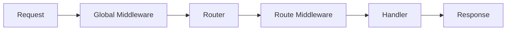

# Guide

This guide covers all the core concepts of Marten in depth.

## Core Concepts

<div class="grid cards" markdown>

-   :material-routes:{ .lg .middle } __Routing__

    ---

    Learn about static routes, path parameters, wildcards, and HTTP methods.

    [:octicons-arrow-right-24: Routing](routing.md)

-   :material-message-text:{ .lg .middle } __Context__

    ---

    The request context provides helpers for params, queries, binding, and responses.

    [:octicons-arrow-right-24: Context](context.md)

-   :material-layers:{ .lg .middle } __Middleware__

    ---

    Add cross-cutting concerns like logging, auth, and rate limiting.

    [:octicons-arrow-right-24: Middleware](middleware.md)

-   :material-folder-multiple:{ .lg .middle } __Route Groups__

    ---

    Organize routes with shared prefixes and middleware.

    [:octicons-arrow-right-24: Route Groups](groups.md)

-   :material-alert-circle:{ .lg .middle } __Error Handling__

    ---

    Handle errors gracefully with custom error handlers.

    [:octicons-arrow-right-24: Error Handling](errors.md)

-   :material-test-tube:{ .lg .middle } __Testing__

    ---

    Write tests for your Marten applications.

    [:octicons-arrow-right-24: Testing](testing.md)

</div>

## Architecture Overview



1. **Request** arrives at the server
2. **Global Middleware** processes the request (logging, recovery, etc.)
3. **Router** matches the path and method to a handler
4. **Route Middleware** runs (auth, validation, etc.)
5. **Handler** processes the request and returns a response
6. **Response** is sent back through the middleware chain

## The App

Everything starts with creating an app:

```go
app := marten.New()
```

The app is the central object that:

- Holds the router
- Manages middleware
- Implements `http.Handler`
- Provides graceful shutdown

## The Context

Every handler receives a context (`*marten.Ctx`) that wraps the request and response:

```go
func handler(c *marten.Ctx) error {
    // Access request
    method := c.Method()
    path := c.Path()
    
    // Get parameters
    id := c.Param("id")
    page := c.QueryInt("page")
    
    // Bind JSON
    var data MyStruct
    c.Bind(&data)
    
    // Send response
    return c.OK(data)
}
```

## Handlers

Handlers are functions that process requests:

```go
type Handler func(*Ctx) error
```

Returning an error triggers the error handler:

```go
func getUser(c *marten.Ctx) error {
    user, err := findUser(c.Param("id"))
    if err != nil {
        return err // Triggers error handler
    }
    return c.OK(user)
}
```

## Middleware

Middleware wraps handlers to add functionality:

```go
type Middleware func(Handler) Handler
```

Example:

```go
func Timer(next marten.Handler) marten.Handler {
    return func(c *marten.Ctx) error {
        start := time.Now()
        err := next(c)
        log.Printf("Request took %v", time.Since(start))
        return err
    }
}
```

## Next Steps

Start with [Routing](routing.md) to learn how to define your API endpoints.
