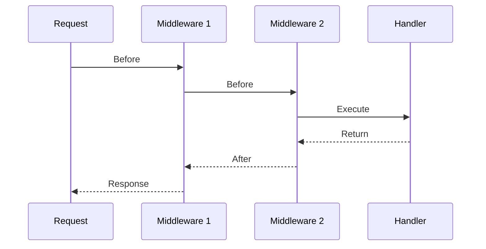

# Middleware

Middleware wraps handlers to add cross-cutting functionality like logging, authentication, and rate limiting.

## How Middleware Works

Middleware is a function that takes a handler and returns a new handler:

```go
type Middleware func(Handler) Handler
```

The middleware can:

1. Execute code **before** the handler
2. Call the next handler
3. Execute code **after** the handler
4. Short-circuit and return early

```go
func MyMiddleware(next marten.Handler) marten.Handler {
    return func(c *marten.Ctx) error {
        // Before handler
        log.Println("Before")
        
        // Call next handler
        err := next(c)
        
        // After handler
        log.Println("After")
        
        return err
    }
}
```

## Using Middleware

### Global Middleware

Applied to all routes:

```go
app := marten.New()
app.Use(middleware.Logger)
app.Use(middleware.Recover)

// Or multiple at once
app.Use(
    middleware.Logger,
    middleware.Recover,
    middleware.CORS(middleware.DefaultCORSConfig()),
)
```

### Group Middleware

Applied to routes in a group:

```go
api := app.Group("/api")
api.Use(authMiddleware)

api.GET("/users", listUsers)    // Has authMiddleware
api.POST("/users", createUser)  // Has authMiddleware
```

### Route-Specific Middleware

Applied to a single route:

```go
app.GET("/admin", adminHandler, authMiddleware, adminOnlyMiddleware)
```

## Execution Order

Middleware executes in the order it's added:

```go
app.Use(mw1, mw2, mw3)
app.GET("/", handler)

// Request flow:
// mw1 -> mw2 -> mw3 -> handler -> mw3 -> mw2 -> mw1
```



## Writing Custom Middleware

### Basic Pattern

```go
func Timer(next marten.Handler) marten.Handler {
    return func(c *marten.Ctx) error {
        start := time.Now()
        
        err := next(c)
        
        duration := time.Since(start)
        c.Header("X-Response-Time", duration.String())
        
        return err
    }
}
```

### With Configuration

```go
type RateLimitConfig struct {
    Requests int
    Window   time.Duration
}

func RateLimit(cfg RateLimitConfig) marten.Middleware {
    // Setup
    limiter := newLimiter(cfg)
    
    return func(next marten.Handler) marten.Handler {
        return func(c *marten.Ctx) error {
            if !limiter.Allow(c.ClientIP()) {
                return c.JSON(429, marten.E("rate limit exceeded"))
            }
            return next(c)
        }
    }
}

// Usage
app.Use(RateLimit(RateLimitConfig{
    Requests: 100,
    Window:   time.Minute,
}))
```

### Short-Circuit

Return early without calling the next handler:

```go
func Auth(next marten.Handler) marten.Handler {
    return func(c *marten.Ctx) error {
        token := c.Bearer()
        if token == "" {
            return c.Unauthorized("missing token")
        }
        
        user, err := validateToken(token)
        if err != nil {
            return c.Unauthorized("invalid token")
        }
        
        c.Set("user", user)
        return next(c) // Only called if auth succeeds
    }
}
```

### Error Handling

```go
func ErrorHandler(next marten.Handler) marten.Handler {
    return func(c *marten.Ctx) error {
        err := next(c)
        
        if err != nil {
            // Log the error
            log.Printf("Error: %v", err)
            
            // Return appropriate response
            var validationErr *ValidationError
            if errors.As(err, &validationErr) {
                return c.BadRequest(validationErr.Message)
            }
            
            return c.ServerError("internal error")
        }
        
        return nil
    }
}
```

## Built-in Middleware

Marten includes 12 production-ready middleware:

| Middleware | Purpose |
|------------|---------|
| [Logger](../middleware/logger.md) | Request logging |
| [Recover](../middleware/recover.md) | Panic recovery |
| [CORS](../middleware/cors.md) | Cross-origin requests |
| [RateLimit](../middleware/ratelimit.md) | Rate limiting |
| [BasicAuth](../middleware/basicauth.md) | Basic authentication |
| [Timeout](../middleware/timeout.md) | Request timeouts |
| [Secure](../middleware/secure.md) | Security headers |
| [BodyLimit](../middleware/bodylimit.md) | Request size limits |
| [Compress](../middleware/compress.md) | Gzip compression |
| [ETag](../middleware/etag.md) | Response caching |
| [RequestID](../middleware/requestid.md) | Request tracking |
| [NoCache](../middleware/logger.md) | Cache prevention |

See [Middleware Reference](../middleware/index.md) for details.

## Common Patterns

### Authentication

```go
func JWTAuth(next marten.Handler) marten.Handler {
    return func(c *marten.Ctx) error {
        token := c.Bearer()
        if token == "" {
            return c.Unauthorized("missing token")
        }
        
        claims, err := jwt.Validate(token)
        if err != nil {
            return c.Unauthorized("invalid token")
        }
        
        c.Set("user_id", claims.UserID)
        c.Set("email", claims.Email)
        
        return next(c)
    }
}
```

### Role-Based Access

```go
func RequireRole(role string) marten.Middleware {
    return func(next marten.Handler) marten.Handler {
        return func(c *marten.Ctx) error {
            userRole := c.GetString("role")
            if userRole != role {
                return c.Forbidden("insufficient permissions")
            }
            return next(c)
        }
    }
}

// Usage
admin := app.Group("/admin")
admin.Use(JWTAuth, RequireRole("admin"))
```

### Request Validation

```go
func ValidateJSON(next marten.Handler) marten.Handler {
    return func(c *marten.Ctx) error {
        if c.Request.ContentLength > 0 && !c.IsJSON() {
            return c.BadRequest("content-type must be application/json")
        }
        return next(c)
    }
}
```

### Metrics

```go
func Metrics(next marten.Handler) marten.Handler {
    return func(c *marten.Ctx) error {
        start := time.Now()
        
        err := next(c)
        
        duration := time.Since(start)
        status := c.StatusCode()
        
        metrics.RecordRequest(c.Method(), c.Path(), status, duration)
        
        return err
    }
}
```

## Best Practices

### 1. Keep Middleware Focused

Each middleware should do one thing:

```go
// Good - single responsibility
app.Use(middleware.Logger)
app.Use(middleware.Recover)
app.Use(middleware.CORS(cfg))

// Avoid - doing too much in one middleware
app.Use(logRecoverCORSMiddleware)
```

### 2. Order Matters

Put middleware in logical order:

```go
app.Use(
    middleware.RequestID,  // First: assign ID for tracking
    middleware.Logger,     // Second: log with ID
    middleware.Recover,    // Third: catch panics
    middleware.RateLimit,  // Fourth: reject excess requests early
    middleware.Auth,       // Fifth: authenticate
)
```

### 3. Don't Modify Request After Handler

```go
// Good
func Middleware(next marten.Handler) marten.Handler {
    return func(c *marten.Ctx) error {
        // Modify request before
        c.Set("start_time", time.Now())
        
        err := next(c)
        
        // Read values after, but don't modify request
        start := c.Get("start_time").(time.Time)
        log.Printf("Duration: %v", time.Since(start))
        
        return err
    }
}
```

## Next Steps

[:octicons-arrow-right-24: Learn about Route Groups](groups.md)
